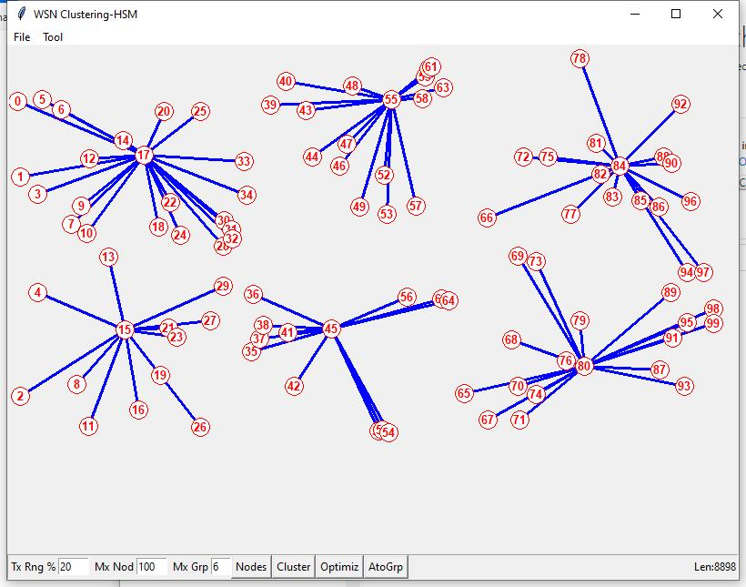

# WSN_Cluster
A Simple Clustering Algorithm for Wireless Sensor Networks (WSN)

Wireless Sensor Networks (WSNs) consist of numerous small, energy-constrained sensor nodes deployed in a geographic area for monitoring and data collection purposes. Due to their limited resources and energy constraints, efficient management and data processing techniques are crucial for the effective operation of WSNs. Clustering algorithms play a vital role in enhancing the network performance by organizing the sensor nodes into groups called clusters. The proposed algorithm utilizes a distributed approach to form clusters, where each cluster has a designated cluster head responsible for managing the intra-cluster communication and aggregating the data from member nodes. 
The cluster formation process begins with an initial network setup, where nodes are randomly deployed in the network area. 

The algorithm assumes all nodes are localized as suggested in https://github.com/hsmazumdar/WSN_Localizer/tree/main using received signal strength from nearest nodes. The algorithm employs a mechanism to dynamically select cluster heads based on their residual energy, communication range, and connectivity with other nodes.

Algorithm:

1. Start
2. nodsz = Get number of nodes
3. grpssz = Get number of clusters
4. grpsz[] = Get node size of each clusters (temp only)
5. dist[][] = Get distance between all nodes
6. i = 0;
7. best = a big number;
8. loop1:
9. 	chn = Get furthest node as cluster head node ch_i
10.	Mark grpsz[i] nearest cluster members state as -1
11.	Choos new cluster head in center of gravity of i_th cluster as ch_i
12.	i = i + 1
13.	if (i < grpssz) 
14.	 Goto loop1
15. goodness = sum of distance between all cluster-heads to members
16. Include nearest members of other groups to each ch by excluding from present group
17. if(best > goodness)
18.	Goto loop1  
19. Update grpsz[]
20. Result: Mark all cluster heads with cluster members	 
21. End

Figure-1 Simulation of a Wireless Sensor Network (WSN) with interactive GUI to demonstrate a new Novel Clustering algorithm.

