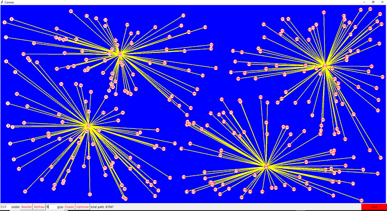

# WSN_Cluster
A Simple Clustering Algorithm for Wireless Sensor Networks (WSN)

Algorithm:

1. Start
2. nodsz = Get number of nodes
3. grpssz = Get number of clusters
4. grpsz[] = Get node size of each clusters (temp only)
5. dist[][] = Get distance between all nodes
6. i = 0;
7. best = a big number;
8. loop1:
9. 	chn = Get furthest node as cluster head node ch_i
10.	Mark grpsz[i] nearest cluster members state as -1
11.	Choos new cluster head in center of gravity of i_th cluster as ch_i
12.	i = i + 1
13.	if (i < grpssz) 
14.	 Goto loop1
15. goodness = sum of distance between all cluster-heads to members
16. Include nearest members of other groups to each ch by excluding from present group
17. if(best > goodness)
18.	Goto loop1  
19. Update grpsz[]
20. Result: Mark all cluster heads with cluster members	 
21. End

Figure-1 Simulation of a Wireless Sensor Network (WSN) with interactive GUI to demonstrate a new Novel Energy Efficient Routing Algorithm. Initially populate selected number of nodes, with random placement on canvas using 'File' menu of by simply pressing (Cnt+d)
