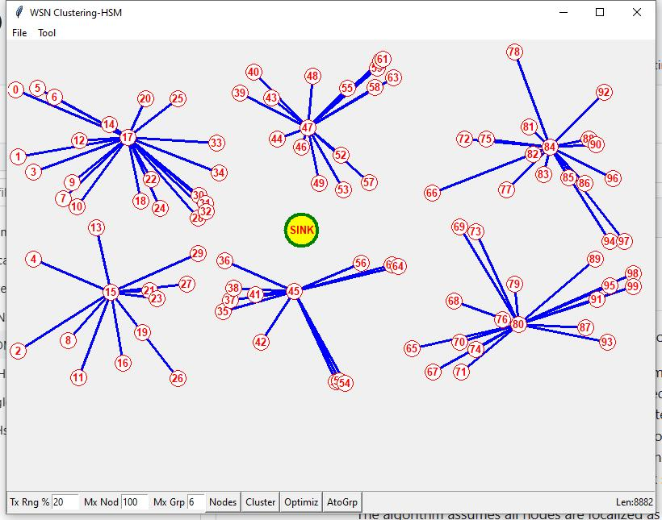

# WSN_Cluster
A Simple Clustering Algorithm for Wireless Sensor Networks (WSN)

A novel approach is presented in this project for managing wireless sensor networks (WSNs), which consist of energy-limited sensor nodes deployed in a specific geographical area to monitor and collect data. The performance of WSNs heavily relies on effective management and data processing techniques. One effective strategy to enhance network performance is the utilization of clustering algorithms to organize sensor nodes into clusters. In this study, we propose a distributed clustering algorithm for WSNs that is both simple and efficient, employing a three-pass localization-based approach.

The algorithm assumes all nodes are localized as suggested in https://github.com/hsmazumdar/WSN_Localizer/tree/main using received signal strength from nearest nodes. Based on this localization data, each node executes the proposed three-pass algorithm to construct a comprehensive clustering map of all nodes in the network. (1) In the first pass, an estimation is made for the desired number of clusters based on the total number of nodes and the average number of nodes within the transmission range of each node. (2) The second pass involves iterative clustering using nearest node grouping and furthest node selection as the subsequent cluster head. (3) Finally, in the third pass, clustering is optimized by regrouping nodes based on the total paths between cluster heads and their member nodes.

Notably, the proposed algorithm incorporates a dynamic cluster head selection mechanism that takes into account factors such as residual energy, communication range, and connectivity with other nodes. This adaptive mechanism enables the algorithm to accommodate changes in node characteristics and network conditions, thereby ensuring efficient and well-balanced cluster formation.

Algorithm:

1. Start
2. nodsz = Get number of nodes
3. grpssz = Get number of clusters
4. grpsz[] = Get node size of each clusters (temp only)
5. dist[][] = Get distance between all nodes
6. i = 0;
7. best = a big number;
8. loop1:
9. 	chn = Get furthest node as cluster head node ch_i
10.	Mark grpsz[i] nearest cluster members state as -1
11.	Choos new cluster head in center of gravity of i_th cluster as ch_i
12.	i = i + 1
13.	if (i < grpssz) 
14.	 Goto loop1
15. goodness = sum of distance between all cluster-heads to members
16. Include nearest members of other groups to each ch by excluding from present group
17. if(best > goodness)
18.	Goto loop1  
19. Update grpsz[]
20. Result: Mark all cluster heads with cluster members	 
21. End

Figure-1 Simulation of a Wireless Sensor Network (WSN) with interactive GUI to demonstrate a new Novel Clustering algorithm.

